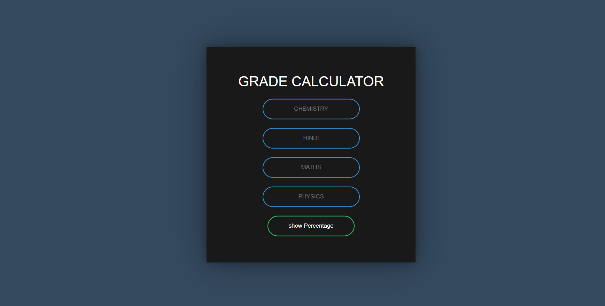

# Student Grade Calculator


The Student Grade Calculator is a web-based application that allows users to input student scores and calculate their final grades. This project is built using HTML, CSS, and JavaScript.

## Table of Contents

- [Features](#features)
- [Technologies Used](#technologies-used)
- [Installation](#installation)
- [Usage](#usage)
- [Contributing](#contributing)


## Features

- Input student names and their scores.
- Calculate final grades based on predefined criteria.
- Display results in a user-friendly table.
- Responsive design for mobile and desktop use.

## Technologies Used

- HTML5
- CSS3
- JavaScript

## Installation

To run this project locally, follow these steps:

1. Clone the repository:

    ```bash
    git clone https://github.com/omgupta7352/student_grade_calculator.git
    ```

2. Navigate to the project directory:

    ```bash
    cd student_grade_calculator
    ```

3. Open `index.html` in your preferred web browser.

## Usage

1. Open the application in your web browser.
2. Enter the student's name and their scores in the input fields.
3. Click the "Calculate Grade" button to see the final grade.
4. The results will be displayed in a table below the input form.

## Contributing

Contributions are welcome! If you would like to contribute to this project, please follow these steps:

1. Fork the repository.
2. Create a new branch for your feature or bugfix:

    ```bash
    git checkout -b feature/your-feature-name
    ```

3. Commit your changes:

    ```bash
    git commit -m 'Add some feature'
    ```

4. Push to the branch:

    ```bash
    git push origin feature/your-feature-name
    ```

5. Open a pull request on GitHub.


